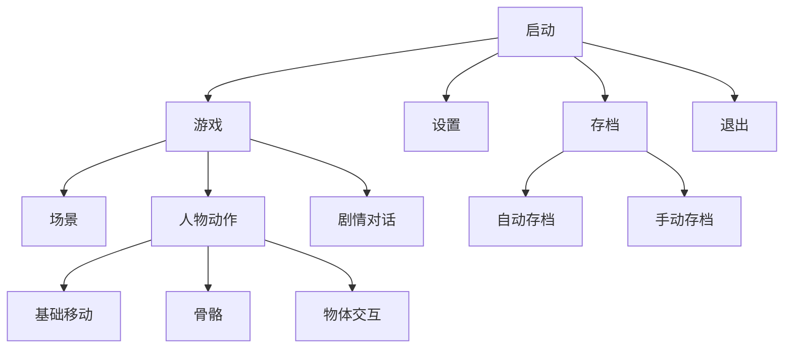
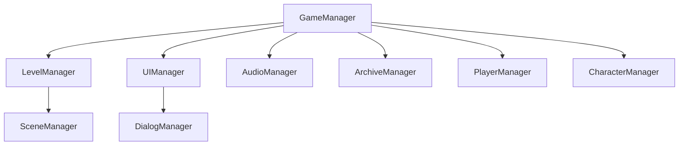

# 某游戏开发程序部分提纲

[《提亚马特与一份名单》](https://github.com/NJUCACGameMaker/Tiamat-and-the-list)（暂定）目前基本定位在剧情向解密平台游戏。在目前正式版策划案及场景元素美工还没有出来时，程序开发暂时做出如下规划。

## 项目结构



## 代码结构



### GameManager

游戏整体管理，管理加载顺序（？），游戏设置，进度等存储。

### LevelManager

负责管理关卡，每个关卡唯一对应一个不同的LevelManager，每一关卡会由多个Scene构成（感觉还是有问题）。LevelManager管理当前关卡所有的场景。
另外，当前玩家角色所持有道具的状态等也由LevelManager控制。
也管理场景转换，过场动画的触发。

### SceneManager

负责管理场景，以及场景中所有可交互物品。也负责处理多物品逻辑相互依赖的复杂情况。我是希望这个通用些，脚本只写一个就好。

### UIManager

管理当前Scene所有UI层的UI。负责其显示切换，浮窗显现，控制交互等。

### AudioManager

管理当前场景的音乐播放，音效触发，对话语音播放。

### ArchiveManager

管理游戏存档的保存与加载，无存档时加载默认配置配置场景。
存档格式：
```Json
{
  "Tutorial":{
    "SceneOne":[
      {
        "index":"0",
        "archive":"......"
      },
      {
        "index":"1",
        "archive":"......"
      }
    ]
    "SceneTwo":[
      {
        "index":"0",
        "archive":"......"
      }
    ]
  }
}
```

### PlayerManager

玩家角色控制

### CharacterManager

管理NPC

### Interoperable

可交互道具的脚本父类，可交互道具的脚本继承自它并需要实现关于自身的存档存取方法和交互提示。SceneManager也会通知其是否在主角附近。

## 对话的存储加载

对话通过读取解析文本直接控制，单条对话的文本格式如下

```Text
Index|SceneName|对话人|文本内容|使用图片或立绘名|分支数（若无分支记为0）(|分支内容|分支跳转行)*n
```

对于一段连续的对话（包括仅一句对话的情况），以一个空行分割（仅为美观）。
两段对话的例子

```Text
1|Scene1|蕾法|肯定能找到线索的。|testCG1|0
2|Scene1|蕾法|一定要证明我父亲的清白！|testCG2|0
3|Scene1|成步堂|蕾法大人很喜欢她的父亲吗？|testCG3|0
4|Scene1|蕾法|刺猬头！|testCG3|0

5|Scene2|Saber|Excallibar!!!|testCG1|0
6|Scene2|Archer|I am the bone of my sword.\123|testCG2|0
7|Scene2|Lancer|Gáe Bolg!|testCG3|0
8|Scene2|Caster|大连有个阿瓦隆|testCG3|0
9|Scene2|Berserker|*(!#$%(#@&^(@#$&%()!@*%)#^&|testCG3|0

10|Scene3|秋濑或|雪辉，你都做了什么?|秋濑或-A|0
11|Scene3|雪辉|成神，我已经是神了，秋濑君|雪辉-A|0
12|Scene3|秋濑或|为了成神，你就杀了关心着你的朋友吗|秋濑或-B|0

13|Scene4|秋濑或|在由乃家我发现了三具尸体，其中一具就是由乃|秋濑或-C|0
```
